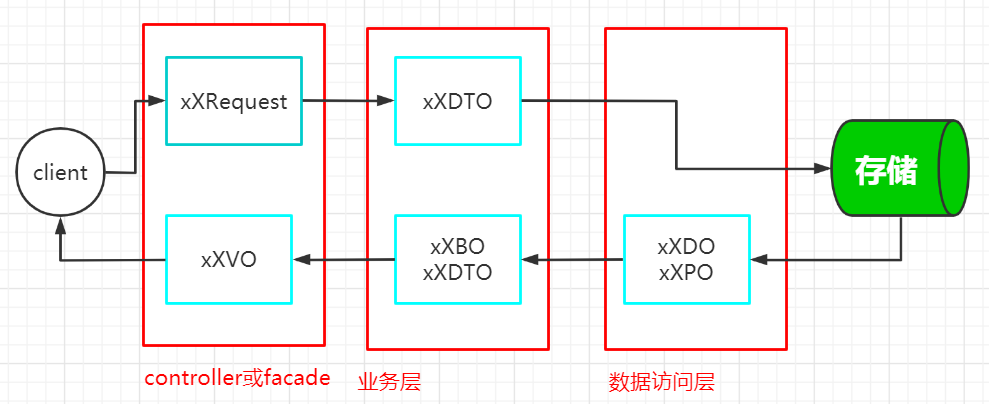

```shell
java代码简洁之道: mapstruct
```


### 一、mapstruct简介

* 官网 : https://mapstruct.org/  ，使用的版本 **1.3.1.Final**

* 使用场景 ： pojo(参考lombok视频：https://www.bilibili.com/video/BV1T64y1Z7Xm/ ) 之间的相互转化。

  

* 不同的convert解决方案

  | 名字                                    | 描述                                                  |
  | --------------------------------------- | ----------------------------------------------------- |
  | mapstruct                               | 基于jsr269实现在编译期间生成代码,性能高,精细控制,解耦 |
  | orika                                   | 能够精细控制,解耦                                     |
  | org.springframework.beans.BeanUtils体系 | 简单易用,不能对属性进行定制处理                       |

### 二、mapstruct的使用

#### 2.1 不使用框架的缺点

* 多而杂的代码与业务逻辑耦合,不能==突出业务逻辑的重点==
* 重复的劳动

#### 2.2 @Mapper

* 默认映射规则

  * 同类型且同名的属性，会自动映射

  * mapstruct会自动进行类型转换
    1. 8种基本类型和他们对应的包装类
    2. 8种基本类型(含包装类)和string之间
    3. 日期类型和string

#### 2.3 @Mappings和@Mapping

* 指定属性之间的映射关系

  * 日期格式化：dateFormat = "yyyy-MM-dd HH:mm:ss"
  * 数字格式化：numberFormat = "#.00"

* source或target多余的属性对方没有，不会报错的

* ignore

* 属性是引用对象的映射处理

  ```java
  @Mapping(source = "driverDTO",target = "driverVO") // 并写上对应的abstract方法
  ```

* 批量映射

####2.4 @AfterMapping和@MappingTarget

* 在映射最后一步对属性的自定义映射处理

#### 2.5 @BeanMapping

* ignoreByDefault : 忽略mapstruct的默认映射行为。避免不需要的赋值、避免属性覆盖

#### 2.6 @InheritConfiguration

* 更新的场景,避免同样的配置写多份

#### 2.7 @InheritInverseConfiguration

* 反向映射不用反过来再写一遍,==注意：只继承@Mapping注解配置，不会继承@BeanMapping==

#### 2.8 与spring结合使用

```java
@Mapper(componentModel = "spring") // 实质就是给生成的类加了@Component
```


